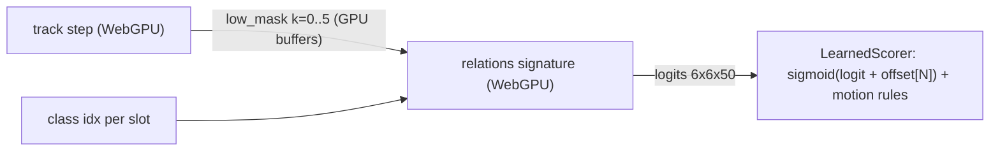

# Relation head (RAM on SAM 2): training, export and use

A small learned **relation head** that turns the SAM 2 masks the demo already
tracks into "subject — predicate — object" relations (e.g. `person kicking
sports ball`) every frame. It is trained offline in PyTorch on PSG (Panoptic
Scene Graph) and runs in the page in plain TypeScript (`app/src/relhead.ts`),
~1–2 ms per frame for up to 6 objects, 0.33 M parameters, 1.3 MB of weights.

```
 offline (Python, CPU)                                   in the page (per frame)
 ─────────────────────                                   ───────────────────────
 PSG images ──▶ SAM 2 (HF, box prompts) ──▶ masks        SAM 2 Tensor API chain (WebGPU)
                 extract_features.py        boxes                 │ low_mask per object
                                            classes               ▼ rt.readMasks (GPU → CPU)
                                              │          relations.ts  RelationEngine.observe
                                              ▼                   │ masks + PSG class per object
                 train_head.py  ──▶ relhead_*.pt                  ▼
                                              │          relhead.ts   LearnedScorer.scoreFrame
                 export_web.py  ──▶ relhead.json/.bin ──▶         │ 50 PSG predicates (+ motion rules)
                                    + calibration                 ▼
                                    + parity fixture     6-frame smoothing ─▶ overlay + relation log
```

## 1. Data

| | |
|---|---|
| Dataset | **PSG** — Yang et al., *Panoptic Scene Graph Generation*, ECCV 2022. Official repository and release: [OpenPSG](https://github.com/Jingkang50/OpenPSG) (dataset site [psgdataset.org](https://psgdataset.org/)). 49k COCO images, 133 COCO panoptic classes, 56 predicates (50 occur in the pilot subset). |
| License | The OpenPSG repository is released under the **MIT License** ([LICENSE](https://github.com/Jingkang50/OpenPSG/blob/main/LICENSE)). PSG is a public research benchmark, so it is suitable for **research use and conference publications** (cite the paper below). The images are COCO 2017 and remain under the [COCO terms of use](https://cocodataset.org/#termsofuse). |
| Official source (default) | `psg.json` from the authors' release linked in the OpenPSG README, plus the COCO 2017 images from the official COCO host. Same train / test split as OpenPSG (`test_image_ids`). |
| Mirror (pilot) | The shipped pilot head was trained from the unofficial Hugging Face parquet mirror `JosephZ/psg_train_sg` / `JosephZ/psg_test_sg` (same images, boxes and relations; still supported with `--source hf`). |
| Subset used | Pilot: 2 train shards → **2,020 train images**, 1 test shard → **725 test images**. |
| Objects | Ground-truth PSG objects (≤ 24 per image, related ones first), prompted into SAM 2 with their boxes. |

```bibtex
@inproceedings{yang2022psg,
  author    = {Yang, Jingkang and Ang, Yi Zhe and Guo, Zujin and Zhou, Kaiyang and Zhang, Wayne and Liu, Ziwei},
  title     = {Panoptic Scene Graph Generation},
  booktitle = {ECCV},
  year      = {2022}
}
```

## 2. Pipeline

Run from `web_demo/` with the project venv (`.venv`, as used by
`tools/build_models.sh`). Extra packages for these scripts:
`pyarrow pillow` (plus torch, transformers, safetensors, numpy;
`huggingface_hub` only for `--source hf`).
Outputs go to `artifacts/psg/` (gitignored), except the exported web model.

| Step | Script | Output | Time (pilot, CPU) |
|---|---|---|---|
| 1. Download PSG | `ram/download_psg.py` | official: `artifacts/psg/official/coco/{train,val}2017/*.jpg` (+ your `psg.json`); hf: `artifacts/psg/psg_{train,test}_sg/data/*.parquet` | ~1–5 min |
| 2. SAM 2 features | `ram/extract_features.py` | `artifacts/psg/feat_{train,test}.npz` | 5 + 2 min |
| 3. Train / evaluate | `ram/train_head.py` | `artifacts/psg/heads/relhead_*.pt`, `results*.json` | ~5 min per variant |
| 4. Export for the web | `ram/export_web.py` | `app/public/models/relhead.{json,bin}`, `app/test/fixtures/relhead_fixture.json` | seconds |

### Step 1 — official PSG (recommended)

1. Open the **full dataset** link in the [OpenPSG README](https://github.com/Jingkang50/OpenPSG#updates)
   (SharePoint, folder `openpsg/data/psg/`) and download **`psg.json`** in the
   browser (SharePoint does not allow scripted downloads) to
   `artifacts/psg/official/psg.json`. The panoptic PNGs are not needed: masks
   come from SAM 2.
2. Fetch the COCO images (only those used; or point `--coco_root` at an existing COCO 2017 copy):

```sh
.venv/bin/python ram/download_psg.py --train_images 2000 --test_images 700   # ~ the pilot size
# .venv/bin/python ram/download_psg.py --train_images 0 --test_images 0      # all PSG images (~19 GB)
# .venv/bin/python ram/download_psg.py --coco_root /data/coco                # existing COCO: just checks

.venv/bin/python ram/extract_features.py --split train --out artifacts/psg/feat_train.npz
.venv/bin/python ram/extract_features.py --split test  --out artifacts/psg/feat_test.npz
# (add --coco_root /data/coco if you used an existing COCO copy, --limit N to cap)
```

### Step 1 — HF mirror (how the shipped pilot head was made)

```sh
.venv/bin/python ram/download_psg.py --source hf --train_shards 2 --test_shards 1
.venv/bin/python ram/extract_features.py --source hf --split train --shards 2 --out artifacts/psg/feat_train.npz
.venv/bin/python ram/extract_features.py --source hf --split test  --shards 1 --out artifacts/psg/feat_test.npz
```

Both sources give identical feature files for the same images (checked on 3
test images: same classes, boxes, relations, masks and pointers). (The
mirror's `image_id` is PSG's image id, not the COCO image file number; this
only matters for locating image files, not for object categories.)

### Steps 3–4

```sh
# Pilot comparison: full / nolabel / geom_label + frequency baseline.
.venv/bin/python ram/train_head.py --train artifacts/psg/feat_train.npz --test artifacts/psg/feat_test.npz

# The model the demo ships: geometry + labels on the S/4 masks with mask boxes (what the page has), width 128.
.venv/bin/python ram/train_head.py --train artifacts/psg/feat_train.npz --test artifacts/psg/feat_test.npz \
    --variants geom_label --geom_res full --box mask --d 128 --epochs 20 --tag _web128

# Export + per-object-count calibration (2..6 objects) + TS parity fixture.
.venv/bin/python ram/export_web.py --ckpt artifacts/psg/heads/relhead_geom_label_web128.pt \
    --test artifacts/psg/feat_test.npz
```

Then check the TypeScript port and the page:

```sh
cd app && npx vitest run test/relhead.test.ts && node test/e2e/relations_check.mjs
```

> In zsh, run one command per split (a `for s in ...; set -- $s` loop does not word-split).

### Step 2 in detail — `extract_features.py`

Each PSG image is squashed to S×S (S = 384, as the page squashes video frames)
and run through **HF `Sam2VideoModel`** loaded by `tools/export_weights.model_at`
— the same weights and tables the demo's `.tflite` is authored from — with every
object prompted by its ground-truth box (point labels 2/3, as the demo prompts
Gemma's boxes). Saved per object: `ptr` [256], the S/4 mask (bit-packed),
mask-pooled `pix_raw` [256], object score, normalized GT box, class; per image:
`pix_raw` [S/16, S/16, 256] (fp16) and the relations.

The shipped `geom_label` head only uses the **masks and classes**; `ptr` /
`pix_raw` are for the `full` / `nolabel` variants.

### Step 3 in detail — `train_head.py`

**Model** (`RelHead`, shipped variant `geom_label`, d = 128):

| Stage | Computation |
|---|---|
| Object token | `[box x0 y0 x1 y1, centre, w, h, mask area]` (9) ‖ class embedding (64, index 0 = unknown) → Linear → LayerNorm → GELU |
| Context | 2-layer pre-norm TransformerEncoder over the image's objects (4 heads, ReLU FF 2d) |
| Pair geometry (8) | centre offset / mean size (dx, dy), log w / h ratios, box IoU, mask IoU, containment s⊂o and o⊂s |
| Pair head | `[tok_s, tok_o, GELU(Linear 8→64)(pair geom)]` → Linear → GELU → Linear → **50 logits** |

- Boxes are the **masks' bounding boxes** (`--box mask`) and geometry is on the
  **S/4 masks** (`--geom_res full`) — exactly what the page has while tracking.
- Loss: multi-label categorical cross-entropy (Su 2020, as RAM) over every
  ordered pair; decision at logit 0. Pairs without relations only push scores down.
- Label dropout 0.2 (the class is replaced by "unknown") so the head still works
  when Gemma's label does not map to a PSG class.
- AdamW (lr 5e-4, wd 0.05), OneCycle, grad clip 1.0, one image per step, seed 0.
- Metrics (PredCls-style, GT objects): acc@1 / acc@5 on annotated pairs,
  graph-constrained R@K / mR@K, and a frequency baseline P(pred | subj cls, obj cls).

### Step 4 in detail — `export_web.py`

- Writes the `state_dict` as concatenated float32 (`relhead.bin`) with a tensor
  table, classes, predicates and config (`relhead.json`).
- **Calibration**: PSG annotates few pairs per image, so the head is
  conservative, and the chance that a pair is related depends on how many
  objects are tracked. On random 2..6-object subsets of the held-out images it
  picks, per object count N, the threshold on the best predicate that maximizes
  F1 for "this pair is related"; the page adds `offsets[N] = -threshold` to the
  logits before the sigmoid.
- **Parity fixture**: 4 test images (masks, classes, PyTorch logits) that
  `app/test/relhead.test.ts` compares the TS port against (max |Δ| ≈ 2e-3).

## 3. How the demo uses it

| File | Role |
|---|---|
| `app/src/main.ts` | Loads the head at start-up (`loadRelHead('models/')`) and swaps the engine's scorer from the rules to `LearnedScorer`; reads masks back once per frame (`rt.readMasks`) and calls `observeRelations`. `?rel=ts` uses the JS head, `?rel=rules` keeps the rules, `?rel=0` disables relations. |
| `app/src/psg_labels.ts` | Maps Gemma's free-form labels to PSG classes (`player → person`): lookup + synonyms, then one text-only Gemma call for the rest, validated against the 133 classes. |
| `app/src/relations.ts` | `RelationEngine`: per-object geometry and velocity, calls the scorer once per frame (`scoreFrame`), 6-frame smoothing, one predicate per pair, the predicate picker filter (`allowed`), and `RelationLog` (frame-indexed, JSON/CSV export). `HeuristicScorer` = the rule-based phase-1 predicates. |
| `app/src/relhead.ts` | `RelHead.forward` — the network in plain TS (no dependencies). `LearnedScorer` — sigmoid(logit + offset[N]), plus the rules' motion predicates (approaching, moving away, chasing) merged by max, since PSG is single images. |
| `app/public/models/relhead.{json,bin}` | The exported weights. |

By default the head runs as a Tensor API model on WebGPU inside the wasm pipeline
(§6). With `?rel=ts`, or when the wasm build has no relation head, it runs on the
**CPU** in JS after the masks are read back from the GPU.

## 4. Results (pilot: 2,020 train / 725 test images, ground-truth objects)

| model | acc@1 | acc@5 | R@20 | R@50 | mR@50 | params | CPU ms (6 obj) |
|---|---|---|---|---|---|---|---|
| frequency | 0.496 | 0.854 | 0.257 | 0.332 | 0.136 | – | – |
| full | 0.527 | 0.904 | 0.393 | 0.455 | 0.205 | 1.44 M | 0.68 |
| nolabel | 0.463 | 0.868 | 0.331 | 0.394 | 0.155 | 1.42 M | 0.57 |
| geom_label | 0.536 | 0.909 | 0.401 | 0.462 | 0.201 | 1.24 M | 0.51 |
| **geom_label web128** (shipped) | 0.540 | 0.914 | 0.403 | 0.466 | 0.200 | 0.33 M | 0.49 |

Calibration (shipped head): F1 0.54 / 0.53 / 0.49 / 0.44 / 0.42 for 2 / 3 / 4 / 5 / 6 objects.

SAM 2's own features (`ptr`, mask-pooled `pix_raw`) did not beat geometry +
labels at this scale.

## 5. Review notes and known limitations

- **No validation split.** The width (d = 128) and epoch count were chosen by
  looking at test-split numbers, and the calibration thresholds are fit on the
  same test split that the metrics are reported on (R@K / acc are threshold-free,
  but the calibration F1 above is optimistic). A proper run should split a
  validation set off the train shards.
- **Pilot scale**: 2 of 46 train shards; more data is the cheapest improvement.
- **Image-level training, video use.** Training masks come from box prompts on a
  single image; in the page they come from tracking, which is noisier.
- **Geometry + class only**: the head never sees pixels, so it cannot tell
  "kicking" from "standing near" when the shapes look alike; it tends to default
  to "looking at" for person → ball.
- **Motion is not learned**: approaching / moving away / chasing are rules on
  screen-space centroid velocity, so camera pans cause false "chasing".
- `extract_features.py` uses the HF PyTorch model, not the `.tflite` the page
  runs (same weights; small numeric differences).
- Data source and license: see §1.

## 6. Running the head with the Tensor API (default; `?rel=ts` for the JS head)

The same head is also authored with the **LiteRT Tensor API** in C++, like the
rest of the pipeline, and runs on WebGPU in the browser (and natively on CPU /
Metal). It reads the per-object `low_mask` buffers the track steps already
wrote, in place; only the `[6, 6, 50]` logits (7 KB) are read back.



| File | Role |
|---|---|
| `ram/export_tensorapi.py` | `relhead.{json,bin}` → `relhead.safetensors` (app + `cc/testdata`), and a parity fixture of 20 cases (2–6 objects, PyTorch logits). |
| `cc/relhead_graph.{h,cc}` | The graph: signature `relations`, inputs `mask_0..5` [1, S/4, S/4], `rel_cls` [6, 134] one-hot, `rel_valid` [1, 1, 6]; output `rel_logits` [6, 6, 50]. |
| `cc/relhead_runner.{h,cc}` | `RelationRunner`: authors, saves and compiles the model; binds the pipeline's mask buffers directly (absent slots get an empty mask). |
| `cc/relhead_graph_test.cc` | gtest against the fixture (`--accelerator=cpu|gpu`, `--gpu_precision=fp16|fp32`). |
| `wasm/sam2_wasm.cc` | `loadRelations(path)`, `relations(t, classes)` (async, JSPI). |
| `app/src/chain/runtime.ts`, `app/src/main.ts`, `app/src/relhead.ts` | `rt.loadRelations` / `rt.relations`; By default it runs for every scored frame and hands the logits to `LearnedScorer.useLogits` (falls back to the TS forward when they don't cover the frame's objects, e.g. when re-scoring stored frames). `?relcheck=1` also runs the TS head and records the agreement. |

Graph notes:

- **Mask boxes in-graph**: binarization is `Relu`/`Mul`/`Sub` (scale 1e4)
  rather than `Greater`/`Cast`, so the graph stays on the GPU delegate. Boxes
  come from `ReduceMax` of row/column occupancy × coordinate ramps; area via
  `Mean`; intersections via `BatchMatMul`. Empty masks give box 0 / area 0,
  like the TS port.
- **Fixed shape**: always 6 slots (`kMaxObjects`). Invalid or empty slots get a
  −1e4 attention key bias (fp16-safe) and are ignored on readback.
- Exact (erf) `Gelu`, as trained. 1/√d is folded into the q weights.
  `head.0` is split into subject / object / pair-geometry column blocks.
- Metal delegate quirk: one op must not consume the same tensor twice
  (`Square(x)` instead of `Mul(x, x)`).

Results:

| Where | Check | Worst \|Δ logit\| | Top-1 agreement | Time |
|---|---|---|---|---|
| native CPU (XNNPACK) | fixture vs PyTorch, 20 cases | 1.5e-5 | 280/280 | 0.13–0.2 ms |
| native Metal fp32 | fixture vs PyTorch | 2.7e-5 | 280/280 | ~1.06 ms |
| native Metal fp16 | fixture vs PyTorch | 0.092 | 280/280 | ~1.05 ms |
| browser WebGPU fp16 | football clip, every tracked frame vs TS head | 0.039 (median 0.014) | 386/386 pairs | ~1.3 ms run + readback |

To reproduce:

```bash
python ram/export_tensorapi.py                 # safetensors + fixture
bazel test --noenable_platform_specific_config \
  //models/sam2/sam2_hiera_tiny_video/web_demo/cc:relhead_graph_test
wasm/build.sh                                  # needs third_party/emsdk, cmake (+ ninja)
cd app && node test/e2e/relations_check.mjs     # REL=ts: JS head
```

At ~1 ms, neither path is a bottleneck. The Tensor API path matters for these
reasons:

- It gives one execution path for native and web.
- It removes the mask readback once the display no longer needs CPU masks.
  Today the page still reads masks back for the geometry and the motion rules.
- It leaves room for heavier heads, e.g. pixel features pooled under the
  masks, which would be too slow in JS.

The Tensor API head is the default. The TS head is the fallback, and `?rel=ts` selects it.

## Files

- `download_psg.py`: fetches PSG. It uses the official `psg.json` plus the COCO images it needs (default), or the parquet shards from the HF mirror.
- `extract_features.py`: runs SAM 2 (HF `Sam2VideoModel`, same weights as the `.tflite`) with box prompts per object. It saves `pix_raw`, `ptr`, masks, pooled features, boxes, classes and relations.
- `train_head.py`: `RelHead` (variants `full` / `nolabel` / `geom_label`), multi-label CE loss, PredCls metrics, frequency baseline.
- `export_web.py`: float32 weights and JSON config for `relhead.ts`, calibration offsets, parity fixture.
- `export_tensorapi.py`: safetensors weights and the parity fixture for the Tensor API graph (§6).
